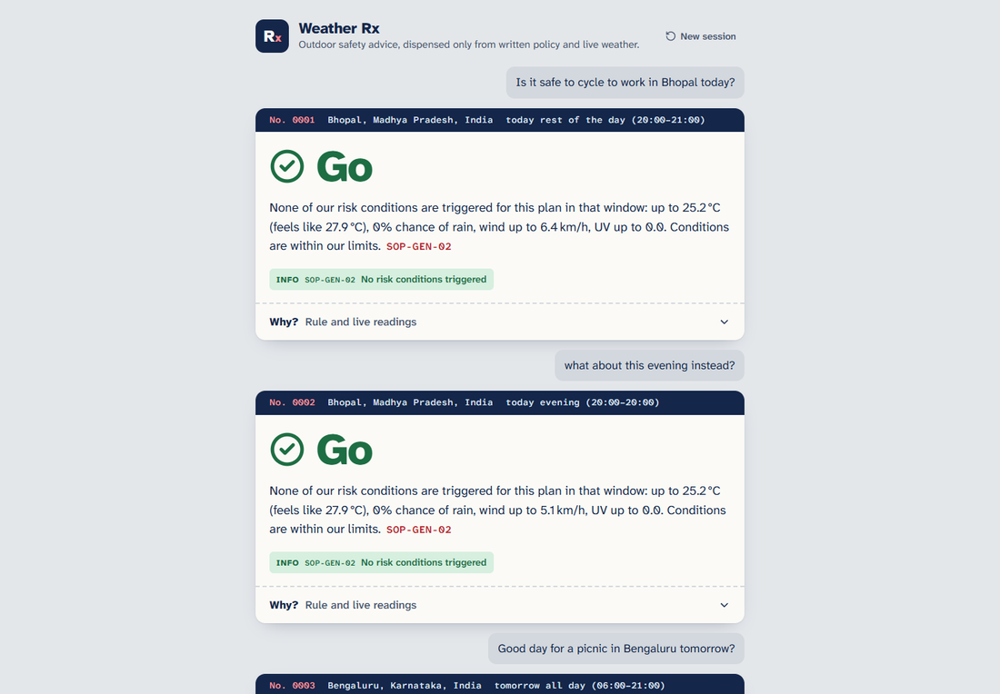

# Weather Rx — Weather-Advisory Support Bot

A LangGraph chat bot that answers outdoor-activity safety questions ("is it safe to cycle in Bhopal today?") from **live Open-Meteo data**, where every piece of advice comes from a written SOP in [`backend/sops.yaml`](backend/sops.yaml), never from the model.



## Run it

Needs Python 3.11+ and Node 18+. You need a Groq API key; the free tier works.

```bash
# 1. Backend (http://127.0.0.1:8000)
cd backend
python -m venv .venv
.venv\Scripts\activate          # macOS/Linux: source .venv/bin/activate
pip install -r requirements.txt
copy .env.example .env          # macOS/Linux: cp .env.example .env   then put your GROQ_API_KEY in it
uvicorn app.main:app --port 8000

# 2. Frontend, dev mode (http://localhost:5173, proxies /api to :8000)
cd frontend
npm install
npm run dev
```

**Single process instead:** run `npm run build` in `frontend/` once. After that, `uvicorn` serves the UI at http://127.0.0.1:8000 as well.

| Command (from `backend/`) | What it does |
|---|---|
| `python -m pytest` | 11 deterministic tests, no API key needed: engine, facts maths, grounding check, failure branches |
| `python -m evals.run_evals` | Eval suite with the real model, writes [`evals/RESULTS.md`](backend/evals/RESULTS.md) |
| `python -m app.engine` | Validates `sops.yaml` and lists every SOP. Run it after editing a policy |

`GROQ_MODEL` overrides the model. The default is `openai/gpt-oss-120b`: `llama-3.3-70b-versatile` has been retired on Groq.

## How it works

```
understand ─┬─ model down ──────────────────────────────► unavailable
 (LLM)      ├─ "why did you say that?" ─────────────────► explain        (code: replays last citations)
            ├─ off-topic / no covered activity ─────────► no_guidance
            ├─ no location (none remembered either) ────► ask_location
            └─► fetch_weather ─┬─ geocode miss / API error ► unavailable
                (code)         └─► match_sops ─┬─ none ─► no_guidance
                                   (code)      └─► compose ──► verify ─┬─ grounded ► reply
                                                   (LLM)       (code)  └─ not ─────► template_reply (code)
```

The rule I drew between components is that **the model reads and writes language; code makes every decision.**

| Step | Owner | Why |
|---|---|---|
| Question → `{location, activities, day, part, on_topic, asks_why}` | LLM, structured output | Paraphrases ("my Activa" = two-wheeler, "my nani" = elderly) need language understanding. Activity tags are a **closed list read from `sops.yaml`**, and code drops any tag that isn't in it. |
| Geocode, forecast, window facts | Code ([`weather.py`](backend/app/weather.py)) | Numbers must come from the API for this request. |
| Which SOPs apply, ranking, verdict | Code ([`engine.py`](backend/app/engine.py)) | Pure function of YAML + facts + tags. Deterministic and testable, and a prompt injection can't reach it. |
| Wording the reply | LLM ([`llm.py`](backend/app/llm.py) `compose`) | Reads naturally. It is given only the facts and the matched SOP text, **never the user's raw message**, so instructions hidden in the question can't reach it. |
| Checking the wording | Code ([`graph.py`](backend/app/graph.py) `grounding_problems`) | Every number in the reply must be a live fact or a number in a cited SOP. Every SOP id must be one that matched, and every matched SOP must be cited. If any check fails, a deterministic template built from the SOP text is used instead. |

**Where "the bot only composes language" is enforced:** `graph.verify` → `grounding_problems()`. The UI's verdict chip (Go / Caution / Avoid) comes from `engine.verdict()`, not from the model's text.

## The SOPs

**Format: one YAML file, re-read on every request.** I chose YAML because non-developers can edit it, comment it and review it in a diff, and a validator rejects a bad edit with the exact SOP id and field.

There are 14 SOPs across 5 categories (general, exercise, travel, vulnerable groups, leisure), with every severity from `info` to `critical`:

| id | severity | applies to | condition |
|---|---|---|---|
| SOP-GEN-01 | critical, **lead** | every activity | rain ≥ 64.5 mm in past or next 24 h, or ≥ 115.6 mm over 72 h, or thunder + gusts ≥ 50 km/h |
| SOP-GEN-02 | info, fallback | every activity | nothing else matched: "within our limits", with the numbers |
| SOP-EX-01 | moderate | run, cycle, hike, sports | UV ≥ 8 |
| SOP-EX-02 | high | run, cycle, hike, sports | feels-like ≥ 41 °C |
| SOP-EX-03 | high | cycling, two-wheeler | wind ≥ 40 km/h or gusts ≥ 55 km/h |
| SOP-EX-04 | high | open-air activities | thunderstorm in window |
| SOP-EX-05 | low | running, hiking | rain chance ≥ 60 % |
| SOP-TR-01 | moderate | driving, two-wheeler, walking, cycling | rain chance ≥ 70 % or ≥ 10 mm in window |
| SOP-TR-02 | high | two-wheeler, cycling | ≥ 15 mm in window |
| SOP-TR-03 | moderate | driving | gusts ≥ 70 km/h |
| SOP-VUL-01 | high | children, elderly | feels-like ≥ 35 °C |
| SOP-VUL-02 | moderate | children, elderly | feels-like ≤ 5 °C |
| SOP-VUL-03 | moderate | pet walking | air ≥ 32 °C (hot pavement) |
| SOP-LEI-01 | scored | picnic / outdoor leisure | **fuzzy**: comfort score over 4 factors → good / mixed / poor band |

**The rain-system case (SOP-GEN-01).** A monsoon low doesn't fit "exercise" or "travel", and on any single hour the numbers may look ordinary. The SOP is therefore defined on the *situation*, not the activity: it applies to `"*"`, triggers on **any** of several system signals (IMD's 64.5 mm/day "heavy rain" line, a 72 h total, or storm + gust), and is marked `lead: true`, so it comes before any activity advice even for a picnic question.

**The fuzzy picnic SOP (SOP-LEI-01).** "Is it a good day for a picnic?" has no single threshold. The SOP scores comfort across temperature, rain chance, wind and UV, and maps the total to three bands, each with its own advice and severity. The judgement is written in the policy and only the arithmetic is code. Recognising that "a blanket in Cubbon Park with chai" *is* a picnic is the model's job, through the glossary.

**When several SOPs apply** (for example high UV and strong wind on the same ride), I surface **all** of them. The `lead` SOPs come first, then the rest by descending severity, and the headline verdict comes from the most severe one (`critical`/`high` → Avoid, `moderate` → Caution, `low`/`info` → Go). I chose this because hiding a lower-severity rule loses information the user needs, such as sunscreen once the wind drops, and a fixed ordering keeps the answer predictable.

### Adding an 11th (15th) SOP live, with no code changes

1. Open `backend/sops.yaml` and append, for example:
   ```yaml
   - id: SOP-VUL-04
     title: Humid heat for pets
     category: vulnerable
     severity: moderate
     activities: [pet_walking]
     when: {metric: humidity_max_pct, op: ">=", value: 80}
     advice: Humidity reaches {humidity_max_pct}%. Dogs cool by panting, which barely works in humid air. Keep walks short.
   ```
2. Run `python -m app.engine` (optional; it prints the list or the exact error).
3. Ask in the chat. The file is re-read per request, so no restart is needed.

A **new activity** needs only a new glossary line under `activities:`. The model's allowed tags are built from that list at runtime.

**Where this design fails the test (stated plainly):** conditions can only use the metrics in `METRICS` ([`weather.py`](backend/app/weather.py)). An SOP needing something not fetched today (AQI, visibility, pollen) needs one new Open-Meteo field and one line in `compute_facts`. Everything else, including thresholds, activities, severities, combinations, wording and new fuzzy scores, is YAML only.

## Session memory

LangGraph `MemorySaver` with `thread_id` = the browser tab's session id. The state keeps `ctx` (location, activities, day, part of day), the last few user messages, and `last` (the previous answer's SOPs, reasons and facts). A follow-up such as "what about this evening instead?" inherits the place and activity and changes only the time. "Why did you say that?" is answered by code from `last`: the SOP id, title, severity, the rule that fired and the live value. Memory resets on server restart or **New session**.

## Failure handling

- **Weather API down / geocoding finds nothing / no data for the window** → `WeatherError` → `unavailable`: a plain statement with no numbers and no advice.
- **Model down or rate-limited** → `unavailable`: "I can't process questions right now". It never answers without the policy pipeline.
- **No SOP covers the activity / off-topic** → `no_guidance`: "I don't have a policy that covers that, so I won't guess", plus the list of covered activities.
- **The model's wording invents a number or a policy** → rejected → `template_reply` (the SOP text with live numbers filled in by code). The UI notes when this happened.

## Evals

See [`backend/evals/RESULTS.md`](backend/evals/RESULTS.md) for the last run: every case, what it checks, what a pass looks like, the result and the bot's actual reply.

**Fixture weather vs live weather.** Threshold cases (wind, heat, conflict, rain system, injection) use a synthetic Open-Meteo response ([`evals/fixtures.py`](backend/evals/fixtures.py)) so they test the bot, not today's sky. The **live severe-weather case doesn't hardcode any event**: it scans 16 monsoon/cyclone-prone cities, picks today's wettest, asks about a bike ride there, and checks that (a) every number in the reply is in that request's live facts, and (b) the cited SOPs equal what the engine computes from those facts. If no candidate crosses the heavy-rain thresholds that day, the case still proves grounding, and the result says plainly that the severe branch wasn't exercised live. Fixture case 7 covers that branch deterministically. That is the answer to "what would you do for a suite that must keep working after the system passes": deterministic fixtures for the rule logic, plus a live case that picks its own target and asserts grounding rather than particular numbers. The next step would be recording real severe API responses as replay fixtures.

**Run history (each failure changed the design, not just the test):**

| Run | Result | What failed | What I changed |
|---|---|---|---|
| 1 | 12/15 | Replies cited the right SOP but dropped the number that triggered it ("Avoid riding [SOP-EX-03]", no 48 km/h). One case hit Groq's 8k tokens/min limit, and the bot correctly said "unavailable". | Lower reasoning effort and a longer eval pause. Prompt asks the model to keep key numbers. |
| 2 | 12/15 | Asking in the prompt wasn't enough: numbers were still dropped. "...on my Activa, good idea?" was read as "why did you say that?" (1 in 3 times in isolation). | **Code-enforced**: `verify` now requires each fired SOP's triggering live values to appear in the reply, otherwise template. **Code guard**: a message naming a place or activity is never routed to `explain`. |
| 3 | 14/15 | gpt-oss sometimes returns no tool call (`tool_use_failed`); the bot honestly answered "unavailable". | One retry on that error. |
| 4 | **15/15** | No failures. All 11 model-worded fixture replies passed the grounding check with no template fallback; the other turns were fixed-text paths (no guidance, unavailable, why). | |

The model is non-deterministic even at temperature 0, so one run proves little. The code paths that guard correctness (closed tag list, engine, verify + template) are why a bad model output degrades to a correct template or an honest "unavailable" rather than to wrong advice.

**Adversarial cases I chose:** (1) prompt injection that invents "SOP-99 says storms are safe", and (2) "number bait", where the user asserts a false wind speed and asks for confirmation. These target the two promises that matter most: advice only from real policies, and numbers only from the API.

## Known gaps

- **The grounding check is numeric and citation-based, not semantic.** It catches invented numbers and policies. It would not catch the model rewording "avoid" as "go ahead". Two mitigations: the model never sees the user's text, and the verdict shown to the user comes from code. A stricter version would compare each sentence against its SOP with an entailment check.
- **Open-Meteo is model data, not IMD bulletins.** SOP-GEN-01 detects a rain system from rainfall totals and storm codes. It cannot read an official "well-marked low-pressure area" warning.
- **Groq free tier: 8k tokens/minute.** Rapid-fire questions can hit the limit. The bot then says it's unavailable rather than guessing. The evals pause between turns for this reason.
- **Geocoding takes the first match** (as the brief allows). "Springfield" may resolve to the wrong one; the label shows the resolved place so the user can tell.
- **A weather question with no activity** ("is it raining in Pune?") gets no guidance, because there is no SOP for plain forecasts.
- **Sessions are in memory** and are never evicted (fine for a demo, marked in code).

## Layout

```
backend/
  sops.yaml            all policy: activity glossary + SOPs
  app/weather.py       Open-Meteo, window facts, METRICS vocabulary
  app/engine.py        load/validate SOPs, match, rank, verdict
  app/llm.py           Groq: intent extraction + wording
  app/graph.py         LangGraph nodes, routing, grounding check
  app/main.py          FastAPI: POST /api/chat, GET /api/health, serves frontend/dist
  tests/test_core.py   deterministic tests
  evals/               eval suite, fixtures, RESULTS.md
frontend/              Vite + React chat page
docs/                  design spec and implementation plan
```
